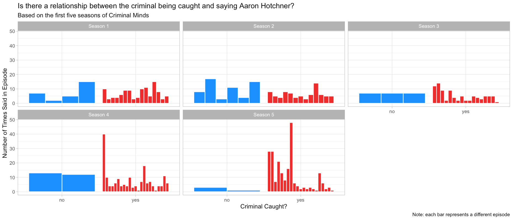
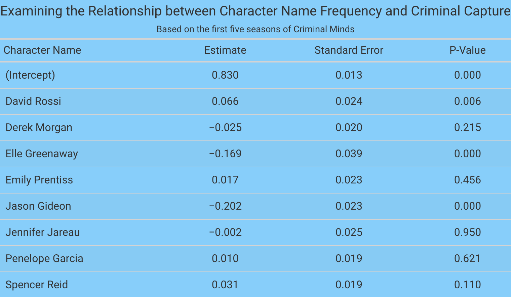

```{r setup, include=FALSE}
knitr::opts_chunk$set(echo = TRUE)
library(knitr)
```

## Abstract

In this project, I perform a script analysis of the first five seasons of the CBS TV show Criminal Minds. Through this analysis, I aim to gain a better understanding of the frequency of different episode characteristics across the five seasons as well as try to find relationships between criminal capture and episode features. Using multiple libraries in R including ggplot, tidyverse, and tidytext to name a few, I am able to visually represent important creative element relationships. Through looking at trends by season and in aggregate over the five seasons, creating a word cloud, breaking features down by criminal capture and episode, and through a regression, I am able to find interesting patterns between creative elements and episode outcome.

\newpage

## Background & Significance

Criminal Minds is a popular procedural crime drama TV series that airs on CBS and is currently in its 15th season. The show follows a group of behavior profilers in the FBI's Behavioral Analysis Unit (BAU) as they investigate the country's most-twisted criminal minds through criminal profiling. In the first five seasons, the team is comprised of Jason Gideon, David Rossi, Aaron "Hotch" Hotchner, Derek Morgan, Dr. Spencer Reid, Emily Prentiss, Jennifer "JJ" Jareau, Penelope Garcia, and Elle Greenaway.

Throughout the many seasons, the BAU team has dealt with a wide variety of crimes and criminals including serial killers, arsonists, and domestic terrorists to name a few. All episodes features some important recurring elements that are crucial to my analysis. In every episode, the audience learns details about the killer including their gender and criminal type. In most, but not all, episodes, the BAU catches the killer. In every episode, different crime-related buzzwords are said, including words like "unsub" (unknown subject), "profile", and "blood" to name a few.

This project aims to uncover relationships between different aspects of the creative elements of the show. A general overview section aims to track the frequency of key buzzwords and character names over the five seasons, look at the genders of and types of criminals the team encounters throughout the show, and count how many times criminals are caught and how many times they evade capture. A word cloud aims to provide a more interactive version of word frequency across the first five seasons by tracking character names and buzzwords across the first five seasons. A criminal analysis portion aims to look at some of the recurring elements of Criminal Minds episodes explored in previous parts of the project to see how they interact with criminal capture. For example, are we able to see a clear trend between word frequency and the outcome of the episode? If Hotch's name is said often in an episode, will a pattern emerge that suggests that the criminal is more likely to be caught? This section aims to tackle questions like these to see if there are any cool trends we can unmask and reveal for character names, buzzwords, life status, and criminal type. Finally, I run a regression to examine the relationships character name frequency, buzzword frequency, and criminal type have with criminal capture to see if any significant relationships emerge.

I ultimately chose to pursue this project because this is one of my favorite TV shows and I thought it would be interesting to look further into creative elements I might not have noticed when initially watching the show.

## Methods

I scrapped scripts from the first five seasons of the show from [Springfield! Springfield!](https://www.springfieldspringfield.co.uk/episode_scripts.php?tv-show=criminal-minds). I gathered the data about creative elements of the show (i.e. whether the criminal was caught, type of criminal, gender, etc.) from the [Criminal Minds Wiki](https://criminalminds.fandom.com/wiki/Criminal_Minds_Wiki) and constructed my own data frame from the information found. I manually constructed lists of key words and character names and used the tidytext package to separate the words of each script into individual tokens, which made analyzing the data significantly easier. I then combined the script tokens with the creative element database to have one data frame that tracked all content from each episode.

In the general overview section, I created bar charts that showed different trends per season and in aggregate. I created plots for character name frequency, buzzword frequency, criminal capture, criminal gender, and criminal type using ggplot. In the word cloud, I decided to only look at the frequency of character names and buzzwords as those were the script characteristics I was most interested in. Using the memoise, tm, and wordcloud packages, I was able to make a word cloud that showed frequency per season of these words, then made it a reactive plot in Shiny. In the criminal analysis section, I again used ggplot to make charts displaying the different characteristics I was interested in. This section focused on tracking trends based on whether the criminal was captured or evaded capture, so each plot featured this division. I made individual plots for each of the main characters that tracked the frequency of their name being said in each episode across the five seasons based on whether or not the criminal was caught. I made similar plots for the top 10 buzzwords as well, choosing only the top 10 criminals as there were about 40 buzzwords total, which seemed like too many to include. For criminal type, I chose to look at the top 10 criminals only for the same reason as with the buzzwords. With criminal types, I only looked at whether certain types of criminals were more likely to be caught by season rather than by episode because each criminal can only be caught or evade capture once per episode, so it did not make sense to look at that trend. For that same reason, when I analyzed whether the criminal was alive at the end of the episode, I looked at this by season since a criminal can only be alive or dead once per episode. Finally, for the regression section, I ran three separate linear regressions, regressing criminal capture on character name frequency, buzzword frequency, and criminal type respectively. In order to do this, I converted the categorical criminal capture variable to a numeric dummy variable where 1 represented the criminal being caught and 0 represented the criminal evading capture. I then used the broom package to gather regression points for all three models and used the gt package to create nice looking tables for the regression output.

## Results & Conclusions

From the general overview, Hotch's name is said most often across all 5 seasons in total, but the only individual season in which his name is said most is Season 5. For the buzzwords, "unsub" is the word said most often across all seasons in aggregate and within in each individual season as well. More often than not, the BAU catches the criminal overall and within each season, which makes sense since viewers probably would not be interested in watching a show where the team can never catch the bad guy. In terms of gender, the criminals were overwhelmingly male, and in Season 3, there were only male killers. For criminal types, the most common criminals the BAU faced were serial killers--this is true overall and by season.

From the criminal analysis, there were many interesting findings in terms of character and buzzword frequency and criminal capture; however, since there are 19 of these plots, I will only mention a few key findings. Whenever Hotch's name was said more than 20 times in an episode, the criminal was always caught, suggesting that the more his name is said, the more likely we will see the criminal caught in the end of the episode (Figure 1). We also see this trend pop up whenever Rossi's name is said over 12 times in an episode and whenever Reid's name is said more than 10 times in an episode (except for one Season 2 episode where Reid's name is said 31 times and the criminal evades capture--however, this was the first part of a two-part episode where the criminal was caught in the second part). An interesting trend in the buzzwords is that for the word "serial", in seasons 1 and 2, the more often 'serial' is said and in the episode with the highest frequency of the word, the criminal evades capture. Interestingly, we see the exact opposite relationship in Seasons 3, 4, and 5. In terms of criminal types, for most criminal types, it was more likely that the BAU would catch more of the criminal within a season than let them escape. However, with stalkers in Season 2, we see that are more likely to evade capture than be caught, which is the only time we see this trend across all of the top 10 criminal types in a season where there were criminals of this type to be caught and evade capture. Finally, for criminal life status, in every season, it was most likely that the criminals would be alive at the end of the episode when caught, but when they evaded capture, there was more variability in life status.

For the regression of character name frequency on criminal capture, all character names are being compared with Aaron Hotchner, whose name represents the reference group. A positive regression coefficient means that with every additional time the character’s name is said, the criminal is more likely to be caught compared to when Hotch’s name is said. A negative coefficient means that with every additional time the character’s name is said, the criminal is less likely to be caught compared to when Hotch’s name is said. Here we see that when Rossi, Prentiss, Garcia, or Reid’s names are said, the criminal is more likely to be caught compared to when Hotch’s name is said whereas the opposite can be said about when Morgan, Greenaway, Gideon, or JJ’s names are said. However, it is important to note that the only statistically significant relationships here are for Rossi, Greenaway, and Gideon’s names (Figure 2).

For the regression of buzzword frequency on criminal capture, all buzzwords are being compared to the word ‘abducted’, which represents the reference group. A positive regression coefficient means that with every additional time the word is said, the criminal is more likely to be caught compared to when ‘abducted’ is said. A negative coefficient means that with every additional time the word is said, the criminal is less likely to be caught compared to when ‘abducted’ is said. Here we say that ‘cannibal’, ‘con’, ‘homicidal’, ‘kidnapper’, ‘pedophile’, ‘poison’, ‘proxy’, ‘sadism’, ‘souvenir’, ‘stalker’, ‘thrill’, ‘trophy’, and ‘unsub’ have positive coefficients, meaning when these words are said more the criminal is more likely to be caught whereas the opposite can be said about the other buzzwords since they have negative regression coefficients. However, it is important to note that the only statistically significant relationships here are for the words ‘bomber’, ‘copycat’, ‘criminals’, ‘hitman’, ‘homicide’, and ‘terrorist’.

For the regression of criminal type on criminal capture, focusing only on the top 10 killer types. All of the killer types in the table are being compared to cop killers, who serve as the reference group. A positive regression coefficient means that a criminal in that category is more likely to be caught than a cop killer whereas a negative coefficient means that a criminal in that category is less likely to be caught than a cop killer. Only family annihilators and spree killers have positive coefficients, meaning that criminals of these types are more likely to be caught than cop killers whereas the opposite is true for the rest of the listed killers. Interestingly enough, none of these relationships are statistically significant, so based on this regression we don’t have sufficient evidence to believe that criminal type influences the likelihood a criminal will be caught.

In terms of limitations, one problem with this analysis is that the script for Season 2, Episode 21 was missing from the script website, so the current analysis is incomplete. Furthermore, the scripts only provided the spoken words, not who spoke them, so a more comprehensive analysis could possibly be done if that information were available for these scripts.

Ultimately, this project aimed to uncover relationships between creative elements of the show and criminal capture. While I think this project definitely highlighted some interesting patterns, there are plenty of opportunities to further the work done. A future project could look at all 15 seasons of the show and see if any of these relationships and patterns found in this project change as the show became more popular. One last interesting avenue to explore would be to track how these things change depending on who the showrunner was at the time or who wrote the episode since this analysis focuses on a lot of creative elements that are ultimately determined by writers and showrunners.

If you'd like to explore other conclusions that were not mentioned in this report as well as figures that were not included for space reasons, feel free to check out the full project [here](https://morganbooker.shinyapps.io/cm_analysis/).

{width=400 height=200}

{width=350 height=155}
